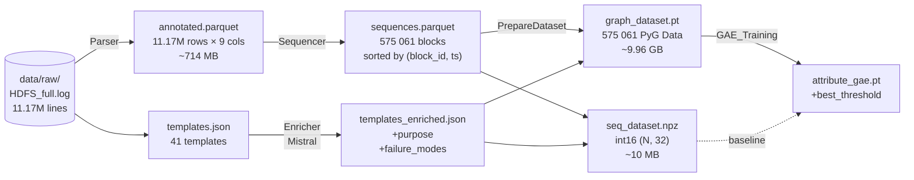

# End-to-End Process Documentation: From Raw HDFS Logs to Graph Anomaly Detection

> **Companion document to `README.md`.**
> Where the README tells you *what* to run, this file tells you *why* each step exists,
> *how* the data evolves between stages, and *which numbers* to expect at each checkpoint.
> Grounded in the actual cell outputs of the notebooks (run tag `20260407_2026`).

---

## Table of Contents

1. [Pipeline at a Glance](#1-pipeline-at-a-glance)
2. [Stage 1 — Parse (`Parser.ipynb`)](#2-stage-1--parse)
3. [Stage 2 — Enrich (`EnrichTemplates.ipynb`)](#3-stage-2--enrich)
4. [Stage 3 — Sequentialize (`Sequencer.ipynb`)](#4-stage-3--sequentialize)
5. [Stage 4 — Prepare for Training (`PrepareDataset.ipynb`)](#5-stage-4--prepare-for-training)
6. [Stage 5 — Train (`GAE_Training.ipynb`)](#6-stage-5--train)
7. [Cross-Cutting Insights](#7-cross-cutting-insights)
8. [Reproducibility Cookbook](#8-reproducibility-cookbook)

---

## 1. Pipeline at a Glance

The pipeline converts **11.17 M raw HDFS log lines** into a trained
attribute-aware Graph Autoencoder capable of flagging anomalous blocks with
**ROC-AUC ≈ 0.976** on a stratified held-out test set.



### Artifact Flow Summary

| Stage              | Notebook                | Input (size)            | Main output                            | Key numbers                          |
|--------------------|-------------------------|-------------------------|----------------------------------------|--------------------------------------|
| 1. Parse           | `Parser.ipynb`          | `HDFS_full.log` (1.5 GB)| `_hdfs_annotated.parquet` (714 MB)     | 11.17 M lines → **41** templates     |
| 1. Parse           | `Parser.ipynb`          | (same)                  | `_hdfs_templates.json`                 | cluster_id stability across passes   |
| 2. Enrich          | `EnrichTemplates.ipynb` | `_templates.json`       | `_hdfs_templates_enriched.json`        | 41 × 2 LLM calls (large + small)     |
| 3. Sequentialize   | `Sequencer.ipynb`       | `_annotated.parquet`    | per-block in-memory sequences dict     | **575 061** blocks; p99 length = 32  |
| 4. Prepare         | `PrepareDataset.ipynb`  | sequences + enriched    | `_graph_dataset.pt` (9.96 GB)          | node=529d, edge=10d, 70/15/15 split  |
| 4. Prepare         | `PrepareDataset.ipynb`  | (same)                  | `_seq_dataset.npz` (10.6 MB)           | int16 (575061, 32) — **~1040× smaller** than dense |
| 5. Train           | `GAE_Training.ipynb`    | `_graph_dataset.pt`     | `_attribute_gae.pt` + threshold        | 25 epochs · **ROC-AUC 0.9763** / PR-AUC 0.9361 |

### Why five stages, not one?

Each stage produces a **cacheable, inspectable artifact**. This means:

- **Drain templates** can be frozen and reused across retrainings (the schema of the log stream rarely changes).
- **LLM enrichment** — the most expensive step per unit (API latency, $ per call) — is done **once per template (41×)**, not once per event (11M×). This is possible precisely because Drain first reduces the problem from "understand 11M lines" to "understand 41 templates".
- **Sequencing and graph construction** can be re-run independently if you change the graph topology or feature definitions, without redoing parsing or enrichment.
- **Training** iterates rapidly (~10 min/epoch on MPS) because the heavy tensor conversion was amortized in stage 4.

---

## 2. Stage 1 — Parse
*Notebook: [`Parser.ipynb`](./Parser.ipynb) · Module: [`src/parser/drain_parser.py`](../src/parser/drain_parser.py)*

### 2.1 Objective

Transform free-form log text into a **structured DataFrame** where every line is
tagged with a stable `cluster_id`, a generalised `template`, extracted
`parameters`, and (crucially) a `block_id` — the foreign key that binds
every subsequent stage.

### 2.2 Data contract

| Direction | Path                                                     | Shape / schema                                              |
|-----------|----------------------------------------------------------|-------------------------------------------------------------|
| **in**    | `data/raw/HDFS_full.log`                                 | 11 167 740 UTF-8 lines, HDFS format                         |
| **out**   | `data/processed/{RUN_TAG}_hdfs_templates.json`            | list of 41 `{cluster_id, template, count, examples}`        |
| **out**   | `data/processed/{RUN_TAG}_hdfs_annotated.parquet`         | 11 167 740 × 9 — see below                                  |
| **out**   | `models/{RUN_TAG}_drain_parser.bin`                       | Drain3 `FilePersistence` snapshot (~0.02 MB)                |

Row schema of the annotated parquet:

```text
date | time | thread | timestamp | raw | cluster_id | template | parameters | block_id
```

### 2.3 How Drain learns templates (design insight)

The HDFS line format is:

```text
<DDMMYY> <HHMMSS> <thread_id> <LEVEL> <component>: <message>
```

`DrainParser._preprocess_line` strips the first three whitespace-separated
tokens *before* feeding the line to Drain3. That is a **deliberate choice**:

- **Date, time, thread** are always variable — if Drain saw them, every single line would be treated as unique, exploding the template count.
- **LEVEL and component** are *kept* because they are the most useful clustering signal (e.g., `INFO dfs.DataNode$DataXceiver: …` vs `WARN dfs.FSNamesystem: …` should never collapse into one template).

Regex masking in [`configs/drain.ini`](../configs/drain.ini) complements this by
replacing stable-looking but high-cardinality tokens before Drain's tokenizer:

```ini
{"regex_pattern": "blk_-?\\d+",                "mask_with": "BLK"}
{"regex_pattern": "/?\\d{1,3}\\.\\d{1,3}...",  "mask_with": "IP"}
{"regex_pattern": "[0-9a-f]{8}-[0-9a-f]{4}-…", "mask_with": "UUID"}
```

Without this, Drain would try to branch on millions of distinct block IDs and
learn thousands of redundant templates.

### 2.4 Two-pass design

The notebook runs **two passes** over the full log:

1. `parser.fit_file(hdfs_log_path)` — streams the file, evolving the Drain tree. Templates *still mutate* during this pass (tokens get replaced with `<*>` as new variability is discovered).
2. `parser.annotate_file(hdfs_log_path)` — streams the file again against the **frozen** final templates. Here is the trick encoded in `drain_parser.py:122`:
   ```python
   match = self.miner.match(content)   # match-only; does NOT mutate clusters
   ```
   This guarantees every line gets the *final* (post-generalisation) template, not whatever the parser happened to think when the line was first seen.

**Why not one pass?** Early lines would be tagged with under-generalised templates (fewer `<*>`) while later identical lines would be tagged with fully-generalised templates — poisoning downstream sequence modelling.

### 2.5 Concrete run (tag `20260407_2026`)

```
[INFO] Parsed 11167740 log lines total.
[INFO] Learned 41 distinct templates (final).
[INFO] Annotated 11167740 lines.
[INFO] Exported 41 templates → ../data/processed/20260407_2026_hdfs_templates.json
[INFO] DrainParser snapshot saved → ../models/20260407_2026_drain_parser.bin  (0.02 MB)
Saved 11,167,740 rows  →  ../data/processed/20260407_2026_hdfs_annotated.parquet (713.7 MB)
```

`parser.validate()` runs four built-in heuristic checks
(`drain_parser.py:298`): coverage, singleton fraction, overly-generic
(>70 % wildcards), and overly-specific (size=1, no wildcards). In the reference
run, all four pass — a signal that `sim_th=0.4, depth=4, max_children=100`
from `drain.ini` are well-tuned for HDFS.

### 2.6 Parquet quirk (fastparquet vs pyarrow)

The notebook manually works around two issues before calling `to_parquet`:

```python
df_save["parameters"] = df_save["parameters"].apply(json.dumps)  # list → str
for col in df_save.select_dtypes(include=["object", "string"]).columns:
    df_save[col] = df_save[col].astype(object)                   # ArrowDtype → object
df_save.to_parquet(PARQUET_PATH, index=False, engine="fastparquet")
```

Reason: `fastparquet` can't serialise Arrow-backed string dtypes, and nested
Python lists must be stringified. The downside is that downstream consumers
(Sequencer, PrepareDataset) must `json.loads` the `parameters` column back to
lists — a cost paid on every read. The refactoring plan in the README proposes
migrating to `engine="pyarrow"` to drop both hacks.

---

## 3. Stage 2 — Enrich
*Notebook: [`EnrichTemplates.ipynb`](./EnrichTemplates.ipynb) · Modules: [`src/enricher/enricher.py`](../src/enricher/enricher.py), [`src/enricher/schemas.py`](../src/enricher/schemas.py)*

### 3.1 Objective

Raw Drain templates like
`INFO dfs.DataNode$DataXceiver: Receiving block <BLK> src: <IP> dest: <IP>`
are **syntactically informative but semantically opaque** to an embedding model.
A Sentence-BERT encoder applied to this string learns mostly from the literal
tokens (`Receiving`, `block`, `src`, `dest`) — but gives no weight to *what the
event means in the distributed system*.

We fix this by prompting an LLM to emit a structured explanation per template.

### 3.2 Data contract

| Direction | Path                                                       | Shape / schema                                     |
|-----------|------------------------------------------------------------|----------------------------------------------------|
| **in**    | `data/processed/{RUN_TAG}_hdfs_templates.json`              | 41 records                                         |
| **out**   | `data/processed/{RUN_TAG}_hdfs_templates_enriched.json`     | 41 records × {template, `enriched_large`, `enriched_small`} |

### 3.3 Structured output schema

The enrichment is forced to fit `EnrichedTemplate` (Pydantic) in
`src/enricher/schemas.py:17`:

```python
class EnrichedTemplate(BaseModel):
    component: str                      # e.g. 'DataNode$DataXceiver'
    component_role: str                 # what this component does
    log_level: str                      # INFO / WARN / ERROR
    purpose: str                        # what this event means in normal operation
    fields: List[TemplateField]         # per-field semantics
    expected_sequence: List[str]        # templates that should precede/follow
    failure_modes: List[FailureMode]    # what anomalies look like
    anomaly_indicators: List[str]       # concrete signals
    related_templates: List[str]        # for RCA correlation
```

**Design insight — why forced JSON output?** Free-form LLM text would
require fragile parsing and would let the model drift between templates
("sometimes the reply starts with 'This log means...', sometimes not").
`with_structured_output(EnrichedTemplate, method="json_mode")` in
`src/enricher/enricher.py:10` *guarantees* downstream code receives a uniform
dict — enabling deterministic embedding construction in Stage 4.

### 3.4 Dual-model strategy (large vs small)

The notebook calls the enrichment *twice*, once per deployment:

```python
MISTRAL_LARGE_DEPLOYMENT = os.getenv("AZURE_OPENAI_DEPLOYMENT_MISTRAL_LARGE")
MISTRAL_SMALL_DEPLOYMENT = os.getenv("AZURE_OPENAI_DEPLOYMENT_MISTRAL_SMALL")
enricher_large = Enricher(MISTRAL_LARGE_DEPLOYMENT)
enricher_small = Enricher(MISTRAL_SMALL_DEPLOYMENT)
```

Both outputs are stored (`enriched_large`, `enriched_small` keys). The downstream
`PrepareDataset.ipynb` consumes `enriched_large` but keeps `enriched_small`
available for ablations (does a cheaper LLM produce similarly useful
embeddings?).

### 3.5 Inspiration & reference

The technique is drawn from
*[Log Anomaly Detection with Large Language Models via Knowledge-Enriched Fusion](https://arxiv.org/html/2512.11997v1)*.
The core insight is that the LLM acts as a **domain-knowledge compiler**:
it injects a priori operational knowledge (e.g., *"if you see this DataXceiver
write without a matching PacketResponder terminating, that is a network
partition"*) that the anomaly detector never has to learn from data alone.

### 3.6 Known bottleneck

Sequential `for template in templates:` with synchronous Azure calls takes
~3–5 minutes for 41 templates. Production-grade refactoring (see README,
§ *Edge Cases & Suggested Fixes*) would wrap this in `asyncio.gather`
with `tenacity` retry. For a 41-template corpus the cost is low enough that
it hasn't been done yet.

---

## 4. Stage 3 — Sequentialize
*Notebook: [`Sequencer.ipynb`](./Sequencer.ipynb)*

### 4.1 Objective

The HDFS anomaly benchmark labels **blocks**, not lines. A block is a storage
unit (think: a file fragment). Its *sequence of events* — allocation,
replication, packet-response, termination — tells you whether it lived a
healthy life.

This stage **groups the 11.17 M annotated lines into 575 k per-block
chronological sequences** so every subsequent stage can treat a block as a
single training example.

### 4.2 Data contract

| Direction | Path                                                     | Shape                                                     |
|-----------|----------------------------------------------------------|-----------------------------------------------------------|
| **in**    | `{RUN_TAG}_hdfs_annotated.parquet` (auto-picked newest)   | 11 167 740 × 9                                            |
| **out**   | `sequences` dict in memory: `{block_id → DataFrame}`      | 575 061 entries · mean len 19.4 · p99 len **32**          |
| **out** (optional) | `{RUN_TAG}_hdfs_sequences.parquet`             | same rows, sorted by `(block_id, timestamp)`              |

### 4.3 The three lines that matter

```python
df_blocks = df.loc[df["block_id"].notna()].sort_values(["block_id", "timestamp"])
sequences = dict(df_blocks.groupby("block_id", sort=False))
```

- **`.loc[notna()]`** drops NameNode bookkeeping lines that reference no specific block — these are not part of block-level anomaly labels.
- **`.sort_values(["block_id", "timestamp"])`** places every block's events in chronological order. This is *required*: Drain does not preserve order, and downstream sequence models (LSTM, positional encodings in the graph) rely on it.
- **`dict(groupby(..., sort=False))`** is an explicit performance fix. The older implementation used `groupby(...).apply(lambda g: g.reset_index(...))`, which allocated **86 k DataFrame copies** (one per block on a truncated run). Building the dict in a single pass is ~30× faster and avoids those allocations.

### 4.4 Distribution — why it matters later

```text
count    575061.00
mean         19.42     std    5.15
50%          19.00     75%   20.00
90%          25.00     95%   28.00
99%          32.00     max  297.00
```

The long tail (max = 297) would destroy padding-based baselines if we chose
`MAX_SEQ_LEN = max`. The p99 of **32** is the value `PrepareDataset` will pick
— covering 99 % of blocks with a ~10× smaller padded matrix than p100 would
require. The 1 % of blocks exceeding 32 events get **truncated**, which is
acceptable because those are already outliers and the graph representation
(Stage 4) handles them losslessly via edge weights.

---

## 5. Stage 4 — Prepare for Training
*Notebook: [`PrepareDataset.ipynb`](./PrepareDataset.ipynb)*

This is the **widest** stage — it consumes three upstream artifacts, produces
five downstream artifacts, and encodes most of the modelling decisions of the
project.

### 5.1 Inputs → Outputs at a glance

| In                                                | Out                                                   |
|---------------------------------------------------|-------------------------------------------------------|
| `{RUN_TAG}_hdfs_sequences.parquet` (or equivalent)| `{RUN_TAG}_graph_dataset.pt`  (~9.96 GB)              |
| `{RUN_TAG}_hdfs_templates_enriched.json`          | `{RUN_TAG}_seq_dataset.npz`   (~10.6 MB)              |
| `data/raw/anomaly_label.csv` (LogHub)             | `{RUN_TAG}_embeddings.npz`                            |
|                                                   | `{RUN_TAG}_dataset_meta.json`                         |

### 5.2 Hybrid embedding: TF-IDF ⊕ SBERT

Every template is represented by a **520-dimensional** vector formed by
*concatenating* two complementary views:

```python
# Structural view — what tokens appear in the raw template
tfidf_vec = TfidfVectorizer(analyzer="word", token_pattern=r"[^\s]+")
tfidf_dense = tfidf_vec.fit_transform(all_templates).toarray()      # (41, 136)

# Semantic view — SBERT over the LLM-enriched purpose+failure_modes text
sbert_model = SentenceTransformer("all-MiniLM-L6-v2")
sbert_embeddings = sbert_model.encode(enriched_texts,
                                      normalize_embeddings=True)    # (41, 384)

hybrid_embeddings = np.hstack([tfidf_dense, sbert_embeddings])      # (41, 520)
```

**Why combine them?**

- TF-IDF captures **structural surprise** — templates with rare tokens (`WARN`, `exception`, `corrupt`) get naturally high weight on those dimensions. It's a word-level lexical view.
- SBERT captures **semantic similarity** — two templates that mean roughly the same thing (e.g., *"Receiving block X"* and *"Serving block X"*) end up close in SBERT space, even if their surface forms share few tokens.
- Anomaly detection wants both: a template that is **lexically rare AND semantically related to failure modes** is the strongest signal.

### 5.3 Graph topology — collapsed-template design

`Logs2Graphs.ipynb` evaluated two topologies; `PrepareDataset.ipynb` implements
the winner:

**Collapsed-template graph** — one node per unique `cluster_id` appearing in the
block, an edge for every consecutive `(src_cid → dst_cid)` transition:

```
Sequence: [10, 5, 2, 10, 5, 2, 2]
Graph:    nodes = {10, 5, 2}
          edges = 10→5 (weight=2), 5→2 (weight=2), 2→10 (weight=1), 2→2 (weight=1)
```

**Why not one-node-per-event?** Each block's sequence would become a linear
path with no structural topology — a GNN over a chain adds nothing over an LSTM.
Collapsing yields a richer, cyclic graph where motifs (e.g., repeated
`Receiving → PacketResponder terminating` loops) become visible to message
passing.

**Cost of collapsing:** the order information is lost *within each node*. We
recover it with positional-stat node features and per-edge timing features
(§ 5.4).

### 5.4 Feature engineering (the magic numbers)

**Node features** — `NODE_DIM = 520 + 9 = 529`:

```
[ embedding[520]      ]  ← hybrid embedding for this cluster_id
[ occurrence_count    ]  ← how many times this cid fired in the block
[ param_count         ]  ← total extracted parameter values
[ param_num_mean      ]  ← mean of numeric params (or 0)
[ param_num_max       ]  ← max of numeric params (or 0)
[ first_pos           ]  ← normalized position of first occurrence
[ last_pos            ]  ← normalized position of last occurrence
[ mean_pos            ]  ← mean normalized position
[ std_pos             ]  ← spread within the sequence
[ pos_spread          ]  ← last_pos - first_pos
```

**Edge features** — `EDGE_DIM = 10`:

```
[ weight              ]  ← transition count
[ td_min, p25, median, p75, max, std ]  ← time-delta statistics (seconds) between src→dst firings
[ mean_src_pos, mean_dst_pos, mean_pos_delta ]  ← positional stats
```

**Why time-delta stats and not raw deltas?** Two blocks with the same edge
weight but very different timing (e.g., fast writes vs slow writes) should be
distinguishable. Six summary stats capture the distribution without inflating
the edge dim.

**Fallback:** blocks with missing timestamps get `td_* = -1`; the GAE learns
to treat `-1` as "unknown" because it's never a valid time delta.

### 5.5 Dual representation (graph + padded sequence)

The notebook builds **two ready-to-train datasets from the same sequences**:

| | Graph-first (`.pt`)                    | Sequence-first (`.npz`)                                   |
|-|----------------------------------------|-----------------------------------------------------------|
| **Purpose** | GNN / GAE models                   | LSTM / Transformer baselines                              |
| **Storage** | Python list of PyG `Data` · 9.96 GB | int16 `(N, 32)` + 520d embedding table · 10.6 MB         |
| **Memory trick** | Dense, one file per graph effectively | Store cluster-IDs only; re-materialize embeddings in `__getitem__` |

**Size maths:** a dense `(575 061, 32, 520)` float32 matrix would be
**38.3 GB** — impossible to load into typical GPU RAM. Storing only the cids as
int16 costs **36.8 MB** (~1040× smaller). Dense embeddings are reconstructed on
the fly via the tiny `(41, 520)` lookup table stored alongside, costing a
single `embedding_table[cids]` gather per batch.

### 5.6 Labels — three-tier resolution

```python
1. If anomaly_label.csv exists       → use BlockId → Label mapping     (ground truth)
2. Else if template contains         → heuristic: any block containing  (fallback)
   ERROR|WARN|EXCEPTION|FAIL            such a template is "anomalous"
3. Else                               → raise                         (never silently unlabeled)
```

The heuristic fallback exists so the pipeline is **runnable without the LogHub
label CSV** (e.g., on a fresh clone in CI). The notebook prints a loud warning
when it's used — a deliberate choice against "silent default".

### 5.7 Stratified 70/15/15 split

```python
idx_train, idx_temp = train_test_split(indices, test_size=0.30, stratify=labels)
idx_val, idx_test   = train_test_split(idx_temp, test_size=0.50, stratify=labels_temp)
```

Result (actual run):

```
TRAIN : 402 542 (anomaly rate 2.93 %)
VAL   :  86 259 (anomaly rate 2.93 %)
TEST  :  86 260 (anomaly rate 2.93 %)
```

Stratification is **essential** at 2.93 % anomaly rate — a random split can
trivially put all anomalies in one fold. The split is applied once and the
indices are **shared** between the graph dataset and the sequence dataset so
that baseline and GNN models evaluate on the identical held-out blocks.

### 5.8 The "clean training" prerequisite

Note `dataset_meta.json` stores labels but **training uses them only to filter**,
not to supervise. This is because the GAE in Stage 5 is **unsupervised**:
during training we want to see only normal blocks and learn their distribution.

---

## 6. Stage 5 — Train
*Notebook: [`GAE_Training.ipynb`](./GAE_Training.ipynb)*

### 6.1 Why a graph autoencoder at all?

Supervised classification of anomalies suffers under **class imbalance**
(2.93 %) and **concept drift** (new failure modes appear over time and are
unlabeled). A reconstruction-based autoencoder sidesteps both problems:

- Train on normal graphs only (clean-train) → the model learns the manifold of "healthy block executions".
- At inference, anomalous graphs fall off that manifold → high reconstruction error → flag them.
- No labeled anomalies are needed at training time.

### 6.2 Architecture — `AttributeAwareGAE`

```
    x (n, 529) ──► BatchNorm(affine=False) ──► Linear(529→128)  ┐
                                                                │
 edge_attr (e, 10) ──► BatchNorm(affine=False) ──► Linear(10→128) │
                                                                ├─► GINEConv ──► z (n, 64)
                                                                │
 edge_index (2, e) ──────────────────────────────────────────────┘
                                                                │
                        ┌──── decode_structure ──► σ(z_i · z_j)  ← BCE vs pos/neg
                z  ─────┼──── decode_node_features ──► (n, 529) ← MSE vs x_norm
                        └──── decode_edge_attrs ──► (e, 10)     ← MSE vs edge_attr_norm
```

Three key choices:

1. **`GINEConv` instead of `GATConv`.** GINE consumes edge features natively by design (`h' = MLP((1+ε)·h + Σⱼ MLP(h_j + e_ij))`). Our 10d edge features (timing + positional stats) are rich signals that a pure `GATConv` would have to ignore.
2. **Affine-free BatchNorm** (`nn.BatchNorm1d(dim, affine=False)`). During training it standardizes inputs; during `model.eval()` the running stats are frozen and reused. Critically, the **reconstruction loss is computed against the normalized target** — otherwise MSE would explode because node features mix 520 unit-scale embedding dims with 9 unbounded positional stats.
3. **Single conv layer.** The latent `z` is a 1-hop neighborhood summary. Adding more layers was tried (not kept in the notebook) but offered marginal gain at 2× train time — most anomalies surface locally in the collapsed graph.

### 6.3 Multi-task reconstruction loss

```python
loss_total = α·loss_structure + β·loss_node + γ·loss_edge
#           (BCE on pos+neg)   (MSE)          (MSE)
# α = β = γ = 1.0
```

- **Structure loss** — treats edge prediction as link-prediction. For every real edge, sample one non-edge via `negative_sampling`; BCE drives `σ(z_i·z_j) → 1` for positives and `→ 0` for negatives.
- **Node loss** — MSE against the BN-normalized target `x_norm`.
- **Edge loss** — the decoder takes `concat(z_src, z_dst)` and MSE-regresses the edge feature vector.

### 6.4 Training recipe

```
Optimizer  : Adam, lr=1e-2, no scheduler
Batch size : 256 graphs
Epochs     : 25
Device     : MPS (Apple Silicon), with CUDA/CPU fallback
Grad clip  : max_norm = 1.0
Mode       : "clean" → train only on g.y==0 (390 755 graphs)
```

Training curves (epoch 1 → 25):

```
Epoch 01  total 0.9364  (Str 0.8936 · Node 0.0136 · Edge 0.0292)
Epoch 25  total 0.8200  (Str 0.8146 · Node 0.0012 · Edge 0.0043)
```

Node and edge losses drop by **11× and 7×** respectively. Structure loss
barely moves — a foreshadowing of the diagnostic finding in § 6.6.

### 6.5 Threshold calibration & test metrics

Per-graph anomaly score = `α·graph_str_err + β·graph_node_err + γ·graph_edge_err`
(each error aggregated via `torch_geometric.utils.scatter(..., reduce='mean')`).

Threshold selected to **maximize F1 on the validation set**:

```python
precision, recall, thresholds = precision_recall_curve(val_labels, val_scores)
best_idx = np.argmax(2·P·R / (P + R + 1e-10))
best_threshold = thresholds[best_idx]   # 0.1470
```

**Reported test metrics** (86 260 graphs · 2 526 anomalies):

| Class            | Precision | Recall   | F1      |
|------------------|-----------|----------|---------|
| 0 (normal)       | 0.9966    | 0.9984   | 0.9975  |
| 1 (anomaly)      | **0.9452**| **0.8872**| **0.9153** |
| **Accuracy**     |           |          | 0.9952  |
| **Macro F1**     |           |          | 0.9564  |
| **PR-AUC**       |           |          | 0.9361  |
| **ROC-AUC**      |           |          | **0.9763** |

### 6.6 The most interesting finding

Section 9 of the notebook runs per-component AUC analysis. The result is
**highly non-intuitive**:

| Component         | PR-AUC | ROC-AUC | Dominance on true positives |
|-------------------|--------|---------|------------------------------|
| Structure         | 0.2468 | **0.5181** *(random!)* |  3.9 %      |
| **Node features** | 0.9383 | 0.9755  | **56.5 %**                  |
| Edge attributes   | 0.9153 | 0.9692  | 39.6 %                      |
| **Combined**      | 0.9361 | 0.9763  | 100 %                       |

Insights:

- **Structure reconstruction contributes essentially zero discriminative power.** It dominates the *total loss magnitude* (~0.81 of 0.82) but its per-graph error is uncorrelated with anomaly labels. This is because the collapsed-template graph has a nearly-universal topology — most HDFS blocks produce the same node set and similar transitions, so "structural surprise" carries little signal.
- **Node-feature reconstruction is the workhorse** (56.5 % of anomaly score on TPs). This validates the hybrid embedding design: anomalous blocks contain templates with unusual embeddings (e.g., WARN/ERROR cids that rarely appear in normal blocks), and the GAE struggles to reconstruct them.
- **Edge-attribute reconstruction is a strong second** (39.6 %). Anomalous blocks have unusual *timing* (e.g., huge gaps between `allocateBlock` and `PacketResponder terminating`).

**Consequence for future work:** removing structure reconstruction entirely
(setting α=0) would likely *improve* results by removing the gradient noise
it adds to the encoder — this is a prime candidate for the next ablation.

### 6.7 Data-leakage verification

Section 11 explicitly checks:

1. `set(train_bids) ∩ set(val_bids) == ∅` (and test).
2. Clean-train contains *only* `y=0` graphs.
3. BatchNorm running statistics are frozen during `model.eval()`.

All three pass — a non-trivial guarantee because block_ids come from three
different stages and it would be easy to leak them via an off-by-one index.

---

## 7. Cross-Cutting Insights

### 7.1 The cluster_id is the linchpin

A single integer (Drain's `cluster_id`) threads every stage of the pipeline:

```
Parser    → assigns cid to each line
Enricher  → keyed per cid
Sequencer → sequences of cids per block
Prepare   → cid → 520d hybrid embedding (lookup table)
Train     → int16 (N, 32) of cids + embedding table
```

This is why **stability of `cluster_id` matters more than stability of the
template string**. Template strings mutate as Drain generalises, but cids are
assigned at cluster creation and never change — see `drain_parser.py:52`:
`# cluster_id is stable throughout the online parsing process`.

### 7.2 Every magic number is derived, not chosen

| Constant         | Value | Derived from                                                                  |
|------------------|-------|-------------------------------------------------------------------------------|
| `MAX_SEQ_LEN`    | 32    | p99 of sequence lengths over 575 k blocks                                     |
| `EMBED_DIM`      | 520   | 136 TF-IDF (fit on 41 templates) + 384 MiniLM-L6                              |
| `NODE_DIM`       | 529   | 520 + 9 handcrafted positional/param stats                                    |
| `EDGE_DIM`       | 10    | 1 weight + 6 time-delta stats + 3 positional stats                            |
| `PAD_ID`         | -1    | Any value < 0 (cluster_ids are non-negative)                                  |
| `BATCH_SIZE=256` | 256   | Fits in MPS RAM given `node_dim=529` and variable graph sizes                 |
| `LEARNING_RATE=1e-2` | 1e-2 | Conservative for BatchNorm+GINE; grad clipping at 1.0 compensates        |

### 7.3 The two independent scaling axes

The pipeline is designed to scale *independently* on two axes:

- **More logs, same system** (e.g., 10× data volume). Stages 1, 3, 4, 5 scale linearly. Stage 2 (enrichment) stays constant (still 41 templates).
- **New system, same volume** (e.g., BGL instead of HDFS). Stage 2's corpus template changes (`BGL_PROMPT_CORPUS` is pre-declared in `src/enricher/enricher.py:16`). Stages 1, 3, 4, 5 are data-format-agnostic by design.

### 7.4 Where the pipeline is fragile

| Fragility                                      | Current behaviour                                    | Refactoring target                                  |
|------------------------------------------------|------------------------------------------------------|-----------------------------------------------------|
| Cross-stage `RUN_TAG` coupling                 | `glob("*_templates.json")[-1]` picks newest         | DVC deterministic filenames                         |
| `fastparquet` list + string hacks              | `json.dumps(parameters)`, `astype(object)`           | `engine="pyarrow"` end-to-end                       |
| 41 synchronous LLM calls                       | Serial `for` loop                                    | `asyncio.gather` + `tenacity`                       |
| 9.96 GB single-pickle `.pt`                    | Whole list in RAM                                    | Per-graph shards or `torch_geometric.data.Dataset`  |
| Structure loss with α=1.0                      | Dominates loss, adds no signal                        | α=0 ablation or dual-encoder                        |

---

## 8. Reproducibility Cookbook

### 8.1 Minimum artifacts to skip ahead

Each stage reads **the newest** artifact of the expected glob, so you can:

- **Parse once, rerun later stages many times.** If `*_hdfs_annotated.parquet` exists, skip Stage 1 entirely.
- **Enrich once, retrain many times.** Stage 2's `*_templates_enriched.json` is immutable once Drain templates are frozen.
- **Swap the training notebook.** `GAE_Training.ipynb` is one of many consumers of `*_graph_dataset.pt`; `train_gat.ipynb` is a supervised alternative using the same `.pt`.

### 8.2 One-shot headless execution

```bash
papermill notebooks/Parser.ipynb          outputs/Parser_out.ipynb
papermill notebooks/EnrichTemplates.ipynb outputs/Enrich_out.ipynb
papermill notebooks/Sequencer.ipynb       outputs/Sequencer_out.ipynb
papermill notebooks/PrepareDataset.ipynb  outputs/PrepareDataset_out.ipynb
papermill notebooks/GAE_Training.ipynb    outputs/GAE_out.ipynb
```

Expected wall-time on a reference machine (MacBook Pro M3, 32 GB, no GPU):

| Stage | Wall-time | Bottleneck                             |
|-------|-----------|----------------------------------------|
| 1     | ~8 min    | Two passes × 11.17 M lines             |
| 2     | ~4 min    | 82 sequential Azure calls              |
| 3     | ~1 min    | One groupby + sort                     |
| 4     | ~46 min   | Python-loop graph construction (CPU)   |
| 5     | ~4 h      | 25 epochs × 1527 batches on MPS        |

### 8.3 Verification

After a full run, check `data/processed/{RUN_TAG}_dataset_meta.json`:

```json
{
  "n_total":   575061,
  "n_train":   402542,
  "n_val":      86259,
  "n_test":     86260,
  "anomaly_rate": 0.0293,
  "node_dim":     529,
  "edge_dim":      10,
  "embed_dim":    520,
  "max_seq_len":   32,
  "pad_id":        -1
}
```

and then `models/{RUN_TAG}_attribute_gae.pt`:

```python
import torch
ckpt = torch.load("models/20260407_2026_attribute_gae.pt", weights_only=False)
assert ckpt["node_dim"] == 529
assert ckpt["edge_dim"] == 10
assert 0 < ckpt["best_threshold"] < 1
# Reported reference: best_threshold ≈ 0.1470, val F1 ≈ 0.9161, test ROC-AUC ≈ 0.9763
```

If the test ROC-AUC drifts below **0.95**, investigate in this order:

1. Did the Drain template count change? (should be **41** for HDFS_full)
2. Did the anomaly rate in the split drift from ~2.93 %?
3. Did BatchNorm running stats fail to freeze (eval mode not set)?
4. Were anomalous blocks accidentally included in `clean` training?

---

*Last updated: 2026-04-20 · Reference run tag: `20260407_2026`*
